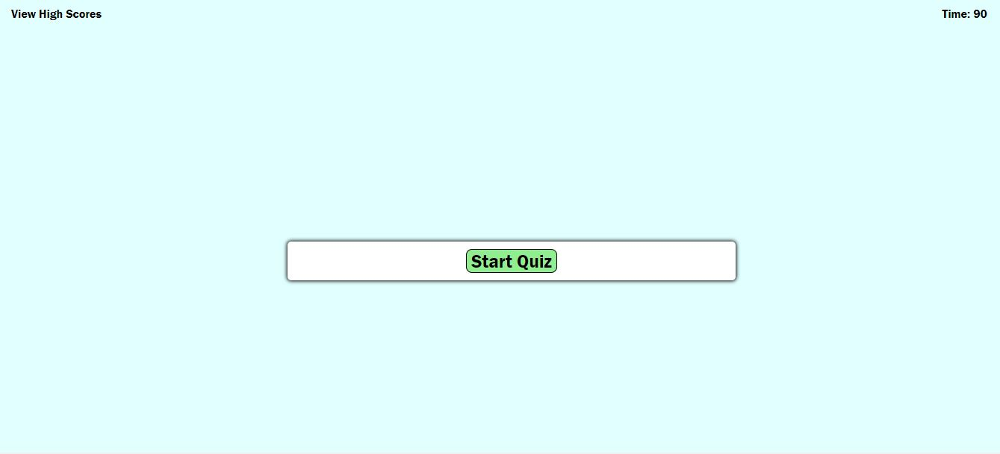
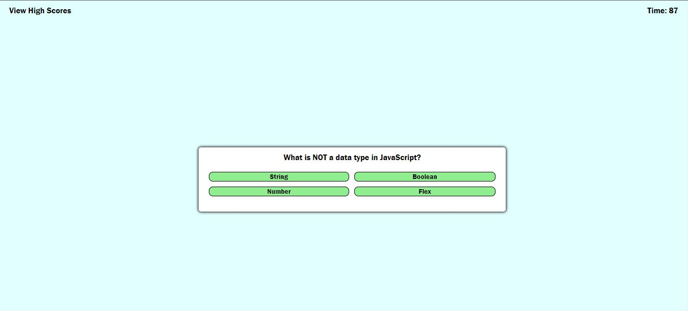
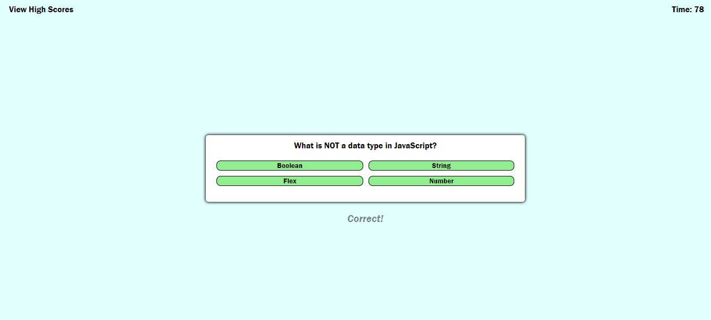
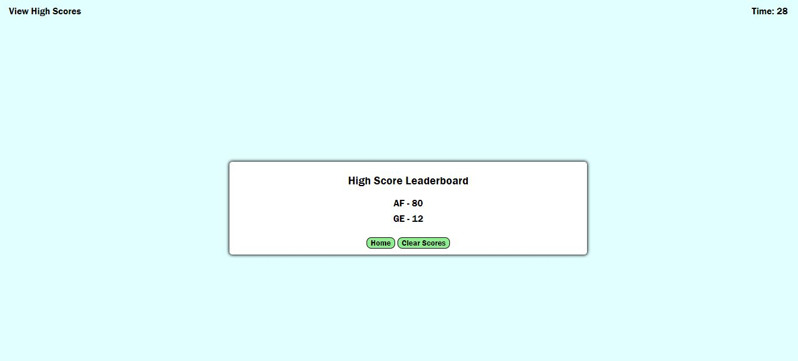

# Code-Quiz

## Description

This repository is a Code Quiz in which coding boot camp students can take to gauge their progress.

## Link to deployed application

[Code Quiz](https://avenix17.github.io/Code-Quiz/)

## Screenshots

## Change Log

### 2022-05-15

* Updated README
* Added images for README
* Fixed showLeaderboard to only show leaderboard and not quiz questions
* Created the actual questions to be used for quiz
* Changed where out of time game over leads
* Added event listeners for home and clear buttons. Fixed issues with leaderboard
* Added home and clear buttons
* Added functions submitHighScore and highScoreLeaderboard
* Added css formatting for leaderboard list
* Added p to high score submission div and ul to leaderboard div

### 2022-05-14

* Created chooseAnswer function, and countdown deductions based on correct vs incorrect
* Added css for feedback div
* Added feedback div
* Created createdQuestions object array and functions for start, showQuestion, and nextQuestion
* Fixed answer-buttons to id like html, added text-align to box div
* Added ids to buttons and created div to view high scores

### 2022-05-13

* Began drafting js, added vars and functions. Created basic timer
* Changed "view high scores" look
* Added span for timer
* Added hide class for highscore submission
* Created div for highscore submission
* Created beginning CSS
* Added buttons, classes, and ids

### 2022-05-09

* Created new README
* Removed original README
* Created files for repository, began basic skeleton of html